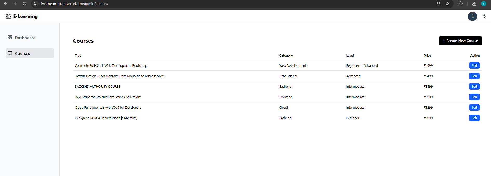
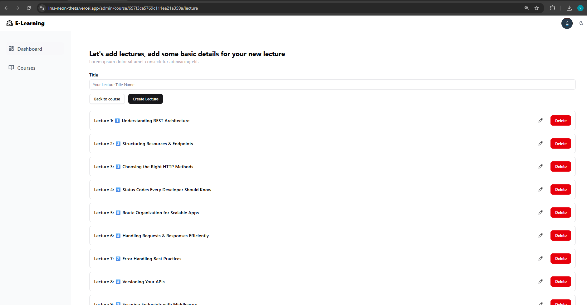
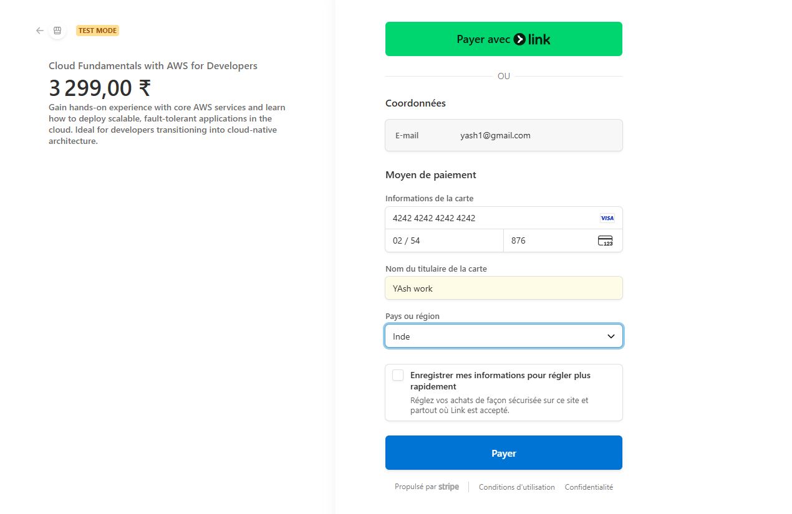

# 🚀 Learning Management Platform

> ⚡ Engineered a production-oriented Learning Management System featuring secure payments, cloud media delivery, and instructor-grade course tooling.

---

# 📸 Product Screens

## Instructor Dashboard


## Course Management


## Lecture Editor


## Student Learning View


## Payment Integration


---
## 📌 Overview

The Learning Management Platform is a full-stack, production-oriented system designed to support modern digital education workflows — enabling instructors to create and monetize courses while allowing students to securely purchase and consume structured learning content.

Built with a strong focus on **scalability, security, and real-world SaaS architecture**, this platform goes beyond CRUD patterns to implement production-grade engineering practices.

> **Note:** The production source code is maintained in a private repository.  
This public repository showcases system architecture, product capabilities, and engineering design.

---
## 💳 How to Test Payments (Stripe Test Mode)

This project uses **Stripe Test Mode**, which allows you to simulate payments without any real money.

### 🔗 Project Links
- **Main Landing Page:** https://lms-neon-theta.vercel.app/  

### 🧪 Test Card Details
Use the following **dummy test card** for all test payments:

- **Card Number:** 4242 4242 4242 4242  
- **Expiry Date:** Any future date (e.g., 12/34)  
- **CVV:** Any 3 digits (e.g., 123)  
- **Cardholder Name:** Any name  
- **ZIP / Postal Code:** Any valid format  

⚠️ *This is a Stripe test card. No real transactions will occur.*

### 📝 Steps to Test
1. Open the landing page link above.  
2. Navigate to the checkout/payment screen.  
3. Enter the test card details provided.  
4. Click **Pay / Complete Payment**.  
5. A **successful payment confirmation** will appear (simulated).

### 🔍 What You Can Verify
- Payment form validation  
- UX of the checkout flow  
- Success & error handling  
- webhook behavior  
- Test transactions in the system

### 🛡️ Notes
- This demo does **not** use real banking systems.  
- No sensitive data is stored.  
- Test payments can be repeated unlimited times.

## 🚀 Engineering Highlights

✅ Built and deployed a functional MVP in **12 days**  
✅ Implemented full payment lifecycle  
✅ Designed instructor-grade admin tooling  
✅ Architected secure authentication  
✅ Integrated cloud media pipeline  
✅ Delivered production-ready infrastructure  

---

## 📈 What This Project Demonstrates

This system reflects strong capability in:

- Full-stack architecture  
- SaaS product thinking  
- Secure backend engineering  
- Payment workflows  
- Media-heavy application design  
- Dashboard systems  
- Rapid product execution  

It showcases the ability to **design, build, and launch complex platforms independently.**

## ⭐ Why This Project Stands Out

Most LMS projects demonstrate basic CRUD functionality.

This system was engineered with **real product patterns**, including:

✅ Secure JWT authentication via HTTP-only cookies  
✅ Stripe-powered payment infrastructure with webhook verification  
✅ Cloud-based media pipeline using Cloudinary  
✅ Role-based platform architecture (Instructor / Student)  
✅ Structured curriculum & lecture management  
✅ Production-style backend design  
✅ Responsive, dashboard-driven UI  

The goal was to simulate how real SaaS education platforms are built.

---

## 🧠 Architecture Overview

```
Client (React + RTK Query)
        ↓
REST API (Node + Express)
        ↓
MongoDB Database

Stripe → Payment Processing  
Cloudinary → Media Storage & CDN
```

Designed with separation of concerns to support future scaling.

---

## 🛠 Tech Stack

### Frontend
- React.js  
- Redux Toolkit  
- RTK Query  
- Tailwind CSS  
- GSAP  
- Axios  

### Backend
- Node.js  
- Express.js  
- MongoDB  
- JWT Authentication (HTTP-only cookies)

### Infrastructure
- Stripe  
- Cloudinary  
- Vercel  
- Render  

---

## 🔐 Security Architecture

Security was implemented using production-style patterns rather than client-side token storage.

✔ HTTP-only cookie authentication  
✔ Protected routes via middleware  
✔ Role-based authorization  
✔ Verified payment events  

This approach significantly reduces XSS attack risk and unauthorized access.

---

## 👨‍🏫 Instructor Capabilities

The platform provides a dedicated instructor experience designed for efficient course lifecycle management.

**Key Features:**

- Create, edit, publish, and remove courses  
- Upload thumbnails and lecture videos  
- Organize structured curriculum  
- Mark lectures as free or paid  
- Set pricing and difficulty levels  
- Monitor enrollments  

Designed to function like a lightweight course CMS.

---

## 🎓 Student Experience

Students benefit from a streamlined learning interface focused on accessibility and clarity.

**Students can:**

- Browse courses  
- View detailed course pages  
- Purchase securely  
- Access enrolled content  
- Stream lectures  
- Manage courses from their profile  

Conditional rendering ensures premium content remains protected.

---

## 💳 Payment Flow

The system implements a **production-grade Stripe lifecycle**.

**Transaction Flow:**

1. User initiates checkout  
2. Backend creates Stripe session  
3. Stripe processes payment  
4. Webhook validates transaction  
5. Enrollment granted automatically  

Webhook validation prevents payment spoofing.

---

## ☁️ Media Handling

Heavy media is offloaded to Cloudinary to avoid server strain.

**Benefits:**
- CDN delivery  
- Optimized playback  
- Reduced backend load  
- Faster content distribution  

---

## ⚡ Performance Considerations

- RTK Query caching minimizes redundant API calls  
- Lazy rendering improves perceived load speed  
- Reusable components reduce bundle size  
- Optimized Mongo queries support scalability  

The system is capable of supporting significantly higher traffic without architectural redesign.

---

---

## 🔮 Future Enhancements

- Course progress tracking  
- Reviews & ratings  
- Instructor analytics  
- Certificates  
- Email notifications  
- AI-driven recommendations  
- Microservices migration  
- Docker deployment  

---

## 👨‍💻 Author

**Yash Chaudhari**  
Full Stack Engineer specializing in scalable React & Node systems.

---

# ⭐ If you found this project valuable, consider starring the repository!

